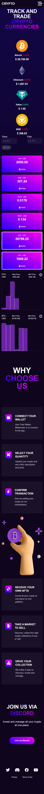

# Crypto

## Built With 🔨

* Vue
* Tailwind
* Websocket
* Localstorage

## Features ✏️

* Real time checking price any crypto currency.
* Display responsive graph of a price.
* Pagination - Responsive pagination and toggle results per page.
* Filter for chosen currencies.
* Save favourite currencies in Localstorage
* Responsive design created by using Tailwind

## Desktop Preview 💻

## Mobile Preview 📱

